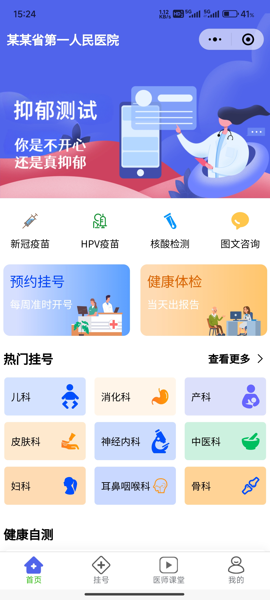
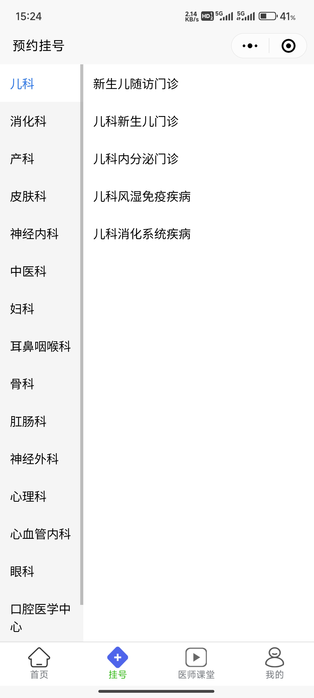
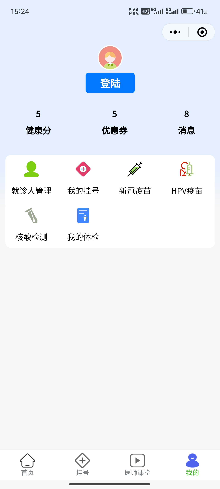

# 智慧医疗挂号小程序

## 介绍
这是一款基于Vue 3和uniapp框架的前端项目，致力于为用户提供便捷、高效的医疗预约服务。在项目开发中，充分发挥Vue 3和uniapp的强大功能，通过与后端团队协同努力，确保了小程序前后端的顺畅对接。采用Vite进行项目构建，搭配Pinia进行状态管理，全面提升了小程序的运行效率。

### 项目说明
智慧医疗挂号小程序体系包含五个端：微信小程序端，H5 端，App 端，PC 端，管理后台。

当前仓库是 **uni-app** 开发的**微信小程序端**，通过**条件编译**能兼容 **H5 端** 和 **App 端**。

### 项目截图

<table>
  <tr>
    <td></td>
    <td></td>
    <td></td>
    <td></td>
    <td></td>
  </tr>
</table>

### 项目源码及接口文档

#### 📦 项目源码

[https://gitee.com/zhou-jinfang/vue3-uni-guahao/](https://gitee.com/zhou-jinfang/vue3-uni-guahao/)

#### 📗 接口文档

[https://dib37d3ed4w.feishu.cn/docx/Bd4vdk8SYoLao5xQMUScU9HWnbf](https://dib37d3ed4w.feishu.cn/docx/Bd4vdk8SYoLao5xQMUScU9HWnbf)

#### 接口说明
后台接口是在实习时负责后端的同事写的，并且接口随时可能被关闭，我只负责项目的前台，该仓库只能用来练手。


### 技术栈
前端框架： Vue 3, uniapp

状态管理： Pinia

项目构建： Vite

类型约束： TypeScript

整合方案： 组合式API

性能优化： Vite, Pinia

### 开发环境

- Windows 版本： Windows 11 家庭中文版

- 开发工具： VS Code 、 HbuilderX 、 微信开发者工具

- Node 版本： v16.15.0

### 微信官方开发工具使用说明

1.  下载安装： 访问微信开发者工具官网，下载适用于你操作系统的微信开发者工具，并进行安装。

2.  注册小程序账号： 如果你还没有微信小程序的开发者账号，需要前往微信公众平台注册账号，并申请成为小程序开发者。

3.  创建小程序： 在微信开发者工具中登录你的小程序账号，选择「新建小程序」，填写相关信息，包括小程序的名称、AppID 等。

4.  打开src/manifest.json文件，微信小程序配置里，更改为你自己的小程序APPID。

5.  打开src/pages/login-page/index.vue，第37行，把appid和secret秘钥改为你自己的小程序appid和秘钥。


### 运行程序

1. 安装依赖

```shell
# npm
npm i --registry=https://registry.npmmirror.com

2. 运行程序

```shell
# 微信小程序端
npm run dev:mp-weixin

# H5端
npm run dev:h5

# App端
需 HbuilderX 工具，运行 - 运行到手机或模拟器
```

3. 微信开发者工具导入 `/dist/dev/mp-weixin` 目录
